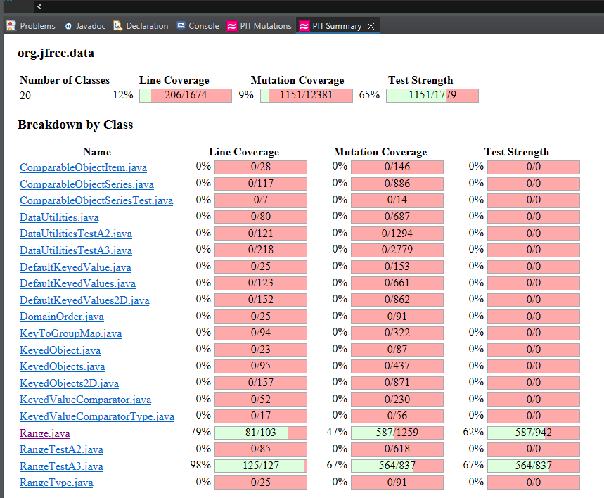

**SENG 438 - Software Testing, Reliability, and Quality**

**Lab. Report \#4 – Mutation Testing and Web app testing**

| Group \#2:      |     |
| -------------- | --- |
| Student Names: |     |
|     Oliver Molina   |     |
|      Quentin Jennings   |     |
|                |     |

# Introduction
In our previous assignments our group has been tasked with testing the JFreeChart program using manual, exploratory, black-box and white-box testing methods. In this lab we will continue to expand our comprehensive testing of the program by employing mutation testing, which is when small modifications to the code are injected to intentionally cause problems in the form of mutants. Tests are designed around the mutated sections of code with the philosophy that tests that are able to cover small simple error will be able to catch more realistic and complex errors as well. To perform this mutation testing we use Pitest/Pitclipse to automate the creations of mutations and running mutation tests on a set of test cases with the end goal being increasing the mutation score and thus increasing the test coverage.

As part of the assignment we also take a brief look into Web/GUI testing by using the Selenium IDE and Sikulix in Chrome on the Costco website to generate UI test case scripts and automate their execution. Selenium IDE records a series of inputs in a website and verifies that a tested sequence works as intended. Verification points are used to ensure the correct behavior occurs.

# Analysis of 10 Mutants of the Range class 
## __Survived__
### Negated double field lower  
```java
public boolean contains(double value)  
{
        return (value >= this.lower && value <= this.upper);
}
```
In this test case a negation of the lower bound still 
resulted in the the same return value since since our test cases did not use large enough lower and upper bounds for such a bug to be noticed i.e Range.lower = 0.  
###  Post Incrementation/Decrementation in line 225 of Range.combine():  
```java
return new Range(l, u)
```  
 Post incrementation of the values l or u is not detected since the operation is happening post construction of the return object, such an error should be irrelevant as the program stands but could cause errors with future iterations.
### Change to conditional boundaries unoticed
 ```java
    public static Range scale(Range base, double factor) {
        ParamChecks.nullNotPermitted(base, "base");
        if (factor < 0) {
            throw new IllegalArgumentException("Negative 'factor' argument.");
        }
        return new Range(base.getLowerBound() * factor,
                base.getUpperBound() * factor);
    }
 ```
Changes to the boundaries of factor are such as changing it to greater than or equal to are not caught with our tests, the set of inputs we run our test cases on should be expanded to include the such possible boundary conditions.

### No coverage for value = 0 condition
```java
    private static double shiftWithNoZeroCrossing(double value, double delta) {
        if (value > 0.0) {
            return Math.max(value + delta, 0.0);
        }
        else if (value < 0.0) {
            return Math.min(value + delta, 0.0);
        }
        else {
            return value + delta;
        }
    }
```
In the last return line, any alterations to return  value + delta, are unnoticed as our test cases did not account for this case which could have resulted in major errors.

### Replace int return with 0 for org/jfree/data/Range::hashCode
```java
    public int hashCode() {
        int result;
        long temp;
        temp = Double.doubleToLongBits(this.lower);
        result = (int) (temp ^ (temp >>> 32));
        temp = Double.doubleToLongBits(this.upper);
        result = 29 * result + (int) (temp ^ (temp >>> 32));
        return result;
    }
```
This test was designed to check for consistent hash code return values however it did not validate whether or not the values returned were infact the correct value.
## __Killed__

### Negated conditional 
```java
public static Range combine(Range range1, Range range2) {
    if (range1 == null) {
        return range2;
    }
    if (range2 == null) {
        return range1;
    }
    double l = Math.min(range1.getLowerBound(), range2.getLowerBound());
    double u = Math.max(range1.getUpperBound(), range2.getUpperBound());
    return new Range(l, u);
}
```
This is an example of a very simple mutation. In this tested injection, the PIT test changes `range2 == null` to `range2 != null`. It's pretty expected that a change like this would survive; however, it is important to test even small and obvious things to ensure the program is of high functionality as one would expect. The mutated bug is obviously killed as it will return range1 before being able actually combine the ranges.

### Replaced boolean return value with false for org/jfree/data/Range::equals
```java
public boolean equals(Object obj) {
    if (!(obj instanceof Range)) {
        return false;
    }
    Range range = (Range) obj;
    if (!(this.lower == range.lower)) {
        return false;
    }
    if (!(this.upper == range.upper)) {
        return false;
    }
    return true;
}
```
This is another simply mutation. It replaces the final return value from `true` to `false`. While simple, this mutation is important because it ensures that the main outputs are tested by the suite.

### Remove call to org/jfree/data/Range::\<init\>
```java
public static Range expand(Range range,
                            double lowerMargin, double upperMargin) {
    ParamChecks.nullNotPermitted(range, "range");
    double length = range.getLength();
    double lower = range.getLowerBound() - length * lowerMargin;
    double upper = range.getUpperBound() + length * upperMargin;
    if (lower > upper) {
        lower = lower / 2.0 + upper / 2.0;
        upper = lower;
    }
    return new Range(lower, upper);
}
```
This mutation is a good example because it demonstrates a mutation where a core part of the code is removed. Upon removing the call to `Range(lower, upper)` it truly tests the boundaries of the functionality of the code. Not only is the return value essentially destroyed, the the use of the Range constructor is removed thus breaking the code. If a test case were to not catch this or this mutation were to have survived, it would demonstrate a massive breach in the stability of the program.

### Replaced double subtraction with addition/division/multiplication/modulus
```java
public double getLength() {
    return this.upper - this.lower;
}
```
I grouped up multiple mutations here because they are very similar and do essentially the same thing, and are all killed in the same way. They replace the subtract operator `-` with either an addition `+`, division `/`, multiplication `*`, or modulus `%`. This ruins the mathematical equation that the subtraction is meant to return, and will not allow the mutation to survive.

### Negated double local variable number 1 (or 3)
```java
public Range(double lower, double upper) {
    if (lower > upper) {
        String msg = "Range(double, double): require lower (" + lower
            + ") <= upper (" + upper + ").";
        throw new IllegalArgumentException(msg);
    }
    this.lower = lower;
    this.upper = upper;
}
```
With this, the lower or upper variable are negated. This would make the the larger variable smaller and vice versa. This would, in every case besides some 0s, cause the test case to fail if done properly. This is a great mutation as it tests the test case. 

# Report all the statistics and the mutation score for each test class




# Analysis drawn on the effectiveness of each of the test classes
One of the best ways to kill mutants that we found was to increase our boundary testing. A large portion of surviving mutants related to incrementing or decrementing values by 1, thus the solution was to add test cases with the functions receiving similar values that were up to one integer apart. This alone gained a few percent in the mutation test strength. 


# A discussion on the effect of equivalent mutants on mutation score accuracy
The effect of equivalent mutants has been to significantly decrease the mutation score of each of our test classes reducing the accuracy greatly. There are many surviving mutants where we can see that the function output is exactly identitical and a few possible methods for detecting equivalent mutants are as follow.
## Possible Automatic Detection Systems
1. Use Regex to identify common equivalent mutants i.e  
x+=y -> x-=(-y)
2. Partition functions into relevant and irrelevant sections i.e  
post incrementaton of temporary variables

## Common Equivalent Mutants
### Post Incremnting local variables
The large majority of equivalent mutants we have seen have been some form of this mutant. In such a case we would never see the effect of the mutation since the variable has already been using and its state is no longer important to the overall outcome of the program.
#### Original
```java
    public Range(double lower, double upper) {
        if (lower > upper) {
            String msg = "Range(double, double): require lower (" + lower
                + ") <= upper (" + upper + ").";
            throw new IllegalArgumentException(msg);
        }
        this.lower = lower; 
        this.upper = upper;
    }
```
#### Mutant
```java
    public Range(double lower, double upper) {
        if (lower > upper) {
            String msg = "Range(double, double): require lower (" + lower
                + ") <= upper (" + upper + ").";
            throw new IllegalArgumentException(msg);
        }
        this.lower = lower++; // <---
        this.upper = upper++;
    }
```
### Negating Double Argument on NaN check
In this mutant, changing the value of the argument has no bearing on the argument's data type so the outcome of the function call will never change.
#### Original
```java
    public boolean isNaNRange() {
        return Double.isNaN(this.lower) && Double.isNaN(this.upper);
    }
```
#### Mutant
```java
    public boolean isNaNRange() {
        return Double.isNaN(-this.lower) && Double.isNaN(-this.upper);
    }
```
# A discussion of what could have been done to improve the mutation score of the test suites
Some surviving mutants were a resulted from weak boundary testing that could be caught with a more advanced set of test preconditions.
Other survivors resulted from our usage of getters to validate a tests outcome when the returned variable of the getter may have also been compromised by the mutation in question, a better practice would be to store the desired results prior to executing the sections of code we are subjecting to scrutiny. 
# Why do we need mutation testing? Advantages and disadvantages of mutation testing
## Advantages
Mutation testing does allow us to see how robust our test cases are with respect to small changes in the source code, this is especially helpful in highlighting the efficacy of our tests in managing boundary conditions. 
## Disadvantages
One major disadvantage of mutation testing is the significant time and resources required to conduct it, this time can be reduced through the eilimination of equivalent mutants but even this process takes time.  
# Explain your SELENUIM test case design process
For our Selenium GUI testing we approached our test case design by thinking of the first functionalities a user would want to do with the site: search, view item, add to cart, etc. To design these test cases we simply got Selenium to record us using a specific feature of the site and then added a verification point to ensure the expected outcome occurred by checking if elements or present or by comparing values. We had a few constraints in testing a live website owned by a separate party and our scope of testing was limited, as described later in the Difficulties Encountered section.
# Explain the use of assertions and checkpoints
To ensure that a GUI test produced a correct result we can target a specific aspect of the web page and perform assertion (aka checkpoint) operations that cause the test to fail if a certain condition is or isn't met. When recording test cases it is important to have a clear pass condition and the various "verify" commands in Selenium IDE serve as traditional assert statements seen within test cases. There are many different types of assertions for a web GUI but for our testing purposed we mostly used assertions that verify if a value, page title, or if an element exists to ensure the correct page is reached.

In cases where the tester must verify the assertions manually rather than automatically with assertions, breakpoints may be used to freeze and continue the script after a select point. The tester can verify the information themselves before proceeding.

# how did you test each functionaity with different test data
For the purposes of testing the Costco website we had to perform set-up for each test case to get the data we wanted in place, such as adding items to our cart before testing if we can remove them. In cases where items are added, the captured input recording removes the items from the cart after the test assertion to ensure Selenium captures and replays the necessary operations for both set-up and clean-up to ensure each operation can run in succession of each other with minimal hassle. Each test resets any changes they make to the shopping cart by clearing the item used and thus different test data isn't really required, although we used unique test data in the form of different items added to the cart regardless. No manual assertions were used.


# Discuss advantages and disadvantages of Selenium vs. Sikulix
Selenium checks individual elements and properties of a page with assertion commands while Sikulix captures an image screenshot of the page and compares it to the current page to validate a web page GUI's state. Both IDEs have their advantages and disadvantages: to start, Sikulix is able to capture and interact with elements that arent present within the page's code itself such as HTML5 elements or embeds like games or videos while Selenium can't as it is restricted to interacting with page elements within the website's HTML code. In terms of script capturing, both have a very similar workflow with the main difference coming in the assertions: Selenium must assert individual elements and often elements can be hard to access or hidden behind other elements whereas Sikulix's screen capture is able to identify GUI components on its own without human selection. However, the image processing could be inaccurate or elements could be blocked and unable to be captured by it whereas Selenium is much more explicit with what it asks for.

# How the team work/effort was divided and managed
As required by the project all members were present during both mutation and GUI testing. Using the same pair-testing approach as previous assignments, we split up into two pairs, which each did their individual work before all meeting up to check over each other's work. All members were involved in all stages of the project and each member performed a sizeable and equal amount of work.

# Difficulties encountered, challenges overcome, and lessons learned
Throughout the lab there were quite a few difficulties with both the mutation testing and web GUI testing.

[mutation difficulties]

For the GUI Testing we encountered quite a few difficulties with testing the Costco website with the Selenium IDE. Selenium verify commands were a bit difficult to get working properly since in some cases it can be difficult to tell what element you need to select or if you're trying to read a value or a text. Some of our members have limited experience with HTML so but even for those who did have experience it was difficult to get some assertions to work properly. In addition, the scope of what we were actually able to test using the Selenium IDE was pretty heavily limited both by the IDE and by the site being tested being an actual live site. We could not automate test creation of accounts because that would require actually creating accounts and would not have a way to reset it to make the test repeatable and we could not test form submissions because it would actually submit the forms to Costco. Because of this our test cases were focused on a few smaller subsections of the site.

# Comments/feedback on the lab itself
[stuff]